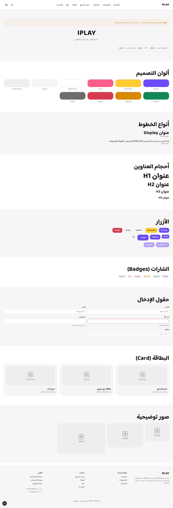
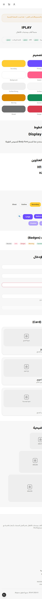

# Day 1 Visual Review — IPLAY Platform

Date: 2026-07-15  
Reviewer: Pre-Day-2 audit (automated + manual inspection)

## Files inspected

| File | Exists | Size | Dimensions |
|------|--------|------|------------|
| `artifacts/day-01/desktop.png` | Yes | 219 KB | 1440 × 4200 px (full page) |
| `artifacts/day-01/mobile.png` | Yes | 117 KB | 390 × 5471 px (full page) |

Both files are valid PNG images with non-zero size. Neither is blank or fully black.

## Desktop review (1440 px width)

**Visible elements confirmed:**

- Header with IPLAY logo, Arabic navigation links, login and cart icons
- Day 1 notice banner (yellow/warning style)
- IPLAY title and Arabic subtitle
- Connection status widget: Frontend / API / Database all show green "متصل"
- Design color swatches (Primary, Secondary, Accent, Background, Surface, status colors)
- Typography section (Display + Body fonts)
- Heading sizes H1–H4
- Button variants (primary, secondary, outline, ghost, danger) and sizes
- Badge variants
- Input states (normal, error, hint, disabled)
- Card components with placeholder images
- Placeholder image sizes
- Footer with logo, description, link columns, WhatsApp/email, copyright

**Visual quality:**

- RTL layout is correct (navigation flows right-to-left)
- Margins and spacing are consistent
- No header overlap or clipped content observed
- Color palette matches the design system tokens
- Typography is readable at desktop scale

**Temporary / expected Day 1 elements:**

- Arabic notice that this is not the final home page
- Placeholder images instead of product photography
- Text-only IPLAY logo (no final brand mark)
- Navigation links point to routes not yet implemented

## Mobile review (390 px width)

**Visible elements confirmed:**

- Compact header with hamburger menu, cart, and user icons
- Same Day 1 notice, title, and connection status widget (all three connected)
- Color swatches in a 2-column grid
- Typography, headings, buttons, badges, inputs, cards, placeholders, footer

**Visual quality:**

- RTL preserved on narrow viewport
- No obvious horizontal overflow (content fits within 390 px width)
- Touch targets (buttons, menu icon) appear adequately sized
- Text remains readable; headings scale down appropriately
- Footer stacks into a single-column layout

**Notes:**

- Full-page capture shows substantial vertical scroll (expected for a design-system page)
- Mobile menu interaction was verified separately during pre-Day-2 audit (opens, locks scroll, closes on link select)

## Issues found

| Issue | Severity | Action |
|-------|----------|--------|
| None blocking Day 1 acceptance | — | — |

Minor observations for Day 2 (not blockers):

- Visual identity is functional but not yet polished (by design for Day 1)
- Hero section and collection presentation are intentionally absent
- Footer social links are placeholders

## Verdict

**Day 1 is visually acceptable as a technical foundation and design-system review page.**

The screenshots accurately represent the current application state. They are suitable
for archival and pre-Day-2 sign-off. Visual identity improvements are explicitly
scoped for Day 2.

## Screenshot paths (relative)

- Desktop: `artifacts/day-01/desktop.png`
- Mobile: `artifacts/day-01/mobile.png`

From this document:

```markdown


```
