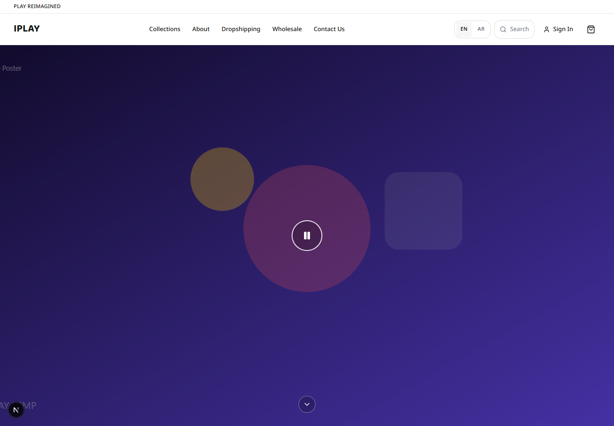
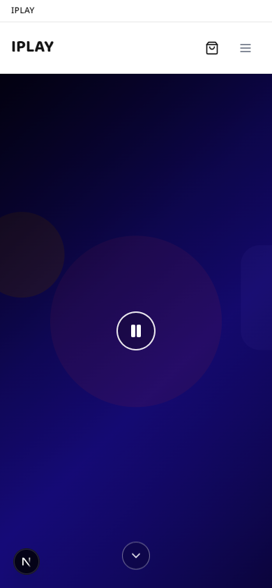

# Day 2 Visual Review — IPLAY Platform

Date: 2026-07-15  
Status: Awaiting review

## Screenshot policy (from Day 1 approval)

Each delivery day provides:

| Type | Dimensions | Required |
|------|------------|----------|
| Desktop viewport | 1440 × 1000 | Yes |
| Mobile viewport | 390 × 844 | Yes |
| Full-page (optional) | Same width, scroll height | Optional |

Day 2 files are under `artifacts/day-02/`.

## Files captured

| File | Dimensions | Size | Type |
|------|------------|------|------|
| `desktop-viewport.png` | 1440 × 1000 | 139 KB | Required viewport |
| `mobile-viewport.png` | 390 × 844 | 76 KB | Required viewport |
| `desktop-full.png` | 1440 × 1876 | 210 KB | Optional full page |
| `mobile-full.png` | 390 × 3822 | 152 KB | Optional full page |

Captured with headless Chrome via `scripts/capture-day02-screenshots.mjs`
(Puppeteer Core). Browser MCP was not used.

## Desktop viewport (1440 × 1000)

**Visible:**

- Transparent header over hero (white IPLAY logo, Arabic nav, icons)
- Hero gradient (violet → pink), badge, Arabic headline with yellow accent
- Dual CTAs (secondary + outline)
- Hero placeholder image with "جديد" badge
- Start of collection section ("مجموعات مميزة") with first row of cards

**Quality:**

- RTL layout correct
- Strong visual hierarchy; hero fills viewport appropriately
- No error overlays or connection-failure messages
- Header hero-mode readable against gradient

## Mobile viewport (390 × 844)

**Visible:**

- Compact header (IPLAY + cart/user icons)
- Full hero stack: badge, headline, description, yellow CTA
- Hero placeholder
- No horizontal overflow observed in viewport capture

**Quality:**

- Text readable; CTA adequately sized
- Gradient and decorative blurs render correctly
- Collection grid begins below fold (expected at 844 px height)

## Full-page captures (optional)

- Desktop full page shows complete hero + four collection cards + Day 2 notice + footer
- Mobile full page shows stacked collection cards and footer

## Browser console / hydration

**Not verified in this session.** Per project policy, console and hydration status
must not be claimed until verified in a clean browser session without inspection-tool
attribute injection. See `docs/PRE-DAY-02-AUDIT.md` and Day 1 approval notes.

## Verdict

Day 2 visual deliverables meet the approved scope: original hero, collection
showcase, scroll-aware header (visible in full-page captures), and improved
identity. Acceptable as the first public-facing visual layer pending review.

## Relative paths

```markdown


```
